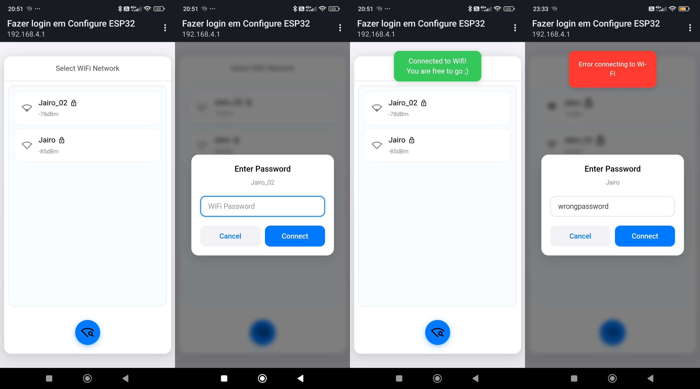

# EasyWifi
<p align="center">

</p>

**EasyWifi** is a versatile Wi-Fi connection manager designed for ESP32 devices. It simplifies Wi-Fi management for IoT projects by enabling features like multiple Wi-Fi credentials, captive portal configuration, and persistent storage using NVS.

## Features

- **Captive Portal**: You will be automatically redirected to Configure Wi-Fi settings via a web interface, 
- **Persistent Storage**: Supports NVS for saving credentials.
- **Fallback Mode**: Automatically switches to AP mode if no connection is available.
- **AsyncWebServer Integration**: Provides fast and responsive web interfaces.
- **Beatiful Lighweight and customizable UI**: You can config the webpage using LittleFS or EEPROM
---
# Installation
## Using PlatformIO

PlatformIO is an open-source ecosystem for IoT development with a cross-platform build system, library manager, and full support for Espressif ESP32 development. It works on popular host OS: Mac OS X, Windows, Linux 32/64, Linux ARM (like Raspberry Pi, BeagleBone, CubieBoard).

### Install PlatformIO Extension for VSCode

1. Install [Visual Studio Code](https://code.visualstudio.com/Download) if not already installed.
2. Install the [PlatformIO IDE extension](https://platformio.org/install/ide?install=vscode):

### Create New Project

1. Create new project using "PlatformIO Home > New Project", Follow the [`documentation`](https://docs.platformio.org/en/latest/core/quickstart.html)

### Add "EasyWifi" Library to Project
Add **EasyWifi** to your project using the [`platformio.ini`](https://docs.platformio.org/en/latest/projectconf/index.html) configuration file and the [`lib_deps`](https://docs.platformio.org/en/latest/projectconf/sections/env/options/library/index.html#lib-deps) option:

```ini
[env:myboard]
platform = espressif32
board = esp32dev
framework = arduino

#using latest stable version
lib_deps = Arthur5492/EasyWifi
# Using the latest development version
lib_deps = https://github.com/Arthur5492/EasyWiFi-ESP32.git


